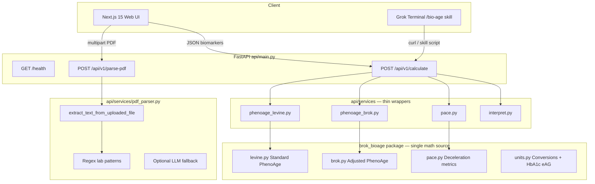
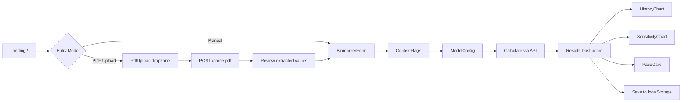

# BROK Bio-Age Tool — System Design Document

| Field | Value |
|-------|-------|
| **Author** | Systems Architect (Draft) |
| **Date** | 2026-06-24 |
| **Status** | Draft (revision 2 — review addressed) |
| **Project** | `brok-bioage-tool` |
| **Workspace** | `/Users/kiki/bio-age-tool` |
| **Reference data** | `data/reference-phenoage.xlsx` (Levine PhenoAge spreadsheet, tabs `UseThisNextX` + historical `*(RI)` tabs) |
| **Python version** | **3.12** (pinned in `pyproject.toml`, Dockerfile, and local setup; dev `.venv` may be 3.14 but CI/prod use 3.12) |

---

## Overview

The BROK Bio-Age Tool is a production-ready monorepo that computes **standard Levine PhenoAge** alongside an improved **BROK PhenoAge** model tuned for biohackers who experience known confounders (creatine supplementation, high testosterone, DEXA body-composition shifts, glucose noise). The tool exposes a FastAPI calculation engine, a Next.js 15 dark-theme UI with charts and interpretation, optional PDF lab-report parsing, and a Grok skill (`/bio-age`) for terminal invocation.

The core insight from the reference spreadsheet and user history: at chronological age 57, the age term alone contributes **~4.58 pheno-years** (`0.0804 × 57`), anchoring scores high regardless of improving biomarkers. RDW (`w=0.3306`) and glucose (`w=0.1953`) dominate biomarker sensitivity; creatinine rises (+1.83 pheno-years for 0.93→1.13 mg/dL) under liposomal creatine loading. The BROK model preserves Levine coefficients for comparability but applies **transparent, user-controlled adjustments** with full audit trails.

**Calibrated default** (20260630 fixture, creatine + T=1239): Standard **53.57** → BROK **~46.8** (`age_alpha=0.95`, creatinine discount capped at **0.50**). Prior draft defaults (`α=0.5`, discount cap 0.85) produced **~23.5** — rejected after review.

**Target latency**: `<50ms` for `/calculate` (pure Python, no LLM). PDF parse: `<2s` regex path, `<8s` with optional LLM fallback.

---

## Background & Motivation

### Current State

- Workspace is greenfield: `venv` + `data/reference-phenoage.xlsx` only.
- User tracks PhenoAge manually in Excel across 10+ dated tabs (`8.2023(RI)` → `20260630(RI)`).
- Verified standard calc for latest labs (20260630 inputs, chrono age 57): **PhenoAge ≈ 53.57** (sheet shows 29.0 because user entered age=29 as de-anchoring experiment).

### Pain Points (from spreadsheet + user context)

| Issue | Evidence | Impact |
|-------|----------|--------|
| Age anchoring | `w_age=0.0804`, age 57 → +4.58 lincomb years | PhenoAge stays ~52–58 despite biomarker wins |
| Creatinine sensitivity | 0.93→1.13 mg/dL = **+1.83 pheno years** | Liposomal creatine (~3 mo daily) misread as kidney risk |
| RDW sensitivity | 12.8→13.3% = **+1.80 pheno years** | Highest biomarker weight (`0.3306`) |
| Glucose noise | 95→105 mg/dL = **+1.18 pheno years** | Fasting glucose volatile; HbA1c preferred |
| No pace tracking | Historical tabs exist but no delta metric | Can't quantify "deceleration years" between draws |

### User Health Context (informs model flags, not medical claims)

- Sustained natural T >1500 ng/dL (latest 1239, slight drop).
- Code Age liposomal creatine ~daily × 3 months → expected creatinine elevation.
- Recent DEXA: bone density up, lean mass up, fat down.
- 2+ year wins: 50% liver reduction, inflammation/joint/reflux resolved.

### Stack Conventions (from `/Users/kiki/neobanx-brok-mvp`)

Reuse proven patterns:

- **FastAPI** (`api/main.py`): CORS middleware, Pydantic models (`pydantic>=2.7` in brok-mvp `requirements.txt`), `GET /health`, file upload with `extract_text_from_uploaded_file` from `api/llm_providers.py`.
- **Next.js 15** (`web/`): React 19, Tailwind, framer-motion, lucide-react, dark theme (`#0a0a0f`, neon cyan `#00f9ff`).
- **Grok skills**: `SKILL.md` with YAML frontmatter (`name`, `description`, `metadata.short-description`) — installed to **both** repo path and `~/.grok/skills/` (see Grok Skill section).
- **Deploy**: Vercel (frontend) + containerized API (Fly.io/Railway/Render per `WEB_UI_MVP.md`).

This project uses **Pydantic v2 patterns explicitly** (`ConfigDict`, `model_validator`, `Field`) even though brok-mvp `main.py` uses plain `BaseModel` without validators.

### Spreadsheet Unit Note

Levine canonical unit for albumin is **g/dL** (`UseThisNextX` row 16). Some `*(RI)` tabs label albumin as `mg/dL` in row 7 (e.g., `20260630(RI)`) — this is a **spreadsheet typo**; values like 4.4 are plausible g/dL. `export_reference_fixtures.py` and API docs enforce g/dL.

---

## Goals & Non-Goals

### Goals

1. Implement **Levine PhenoAge** matching `UseThisNextX` coefficients; RI tabs within ±0.1 pheno years (see tolerance policy).
2. Implement **BROK PhenoAge** with calibrated defaults, configurable age modes, creatinine discount (capped), HbA1c preference, optional DEXA/T modifiers.
3. Compute **pace-of-aging metrics**: delta vs chrono, deceleration years, side-by-side standard vs BROK.
4. Ship **Next.js UI**: manual entry, PDF upload, results charts, biohacker interpretation, disclaimers.
5. Ship **FastAPI** endpoints: `POST /api/v1/calculate`, `POST /api/v1/parse-pdf`, `GET /health`.
6. Ship **Grok skill** callable as `/bio-age`.
7. Provide **Dockerfile** + Vercel deployment instructions + privacy documentation.

### Non-Goals (v1)

- Clinical diagnosis, eGFR estimation from creatinine alone (user may supply eGFR).
- Persistent multi-user database / auth (localStorage session history only in v1).
- Epigenetic (DNAm) clock integration.
- Replacing Levine coefficients with retrained ML model.
- HIPAA compliance certification (document privacy posture; no PHI storage server-side by default).
- Client-side PhenoAge calculation (API-only in v1 — avoids drift from `brok_bioage`).

---

## Proposed Design

### Monorepo File Structure

```
/Users/kiki/bio-age-tool/
├── .grok/
│   └── skills/
│       └── bio-age/
│           └── SKILL.md                 # Source copy; install to ~/.grok/skills/bio-age/
├── api/
│   ├── __init__.py
│   ├── main.py                          # FastAPI app, routes, CORS
│   ├── constants.py                     # MAX_PDF_TEXT_CHARS = 15000
│   ├── .env.example
│   ├── requirements.txt                 # pydantic>=2.7, fastapi, ...
│   ├── models/
│   │   ├── __init__.py
│   │   ├── biomarkers.py                # Pydantic v2 request/response schemas
│   │   └── config.py                    # ModelConfig, AgeMode enum
│   ├── services/                        # THIN WRAPPERS ONLY — see Code Layering
│   │   ├── __init__.py
│   │   ├── phenoage_levine.py           # → brok_bioage.levine
│   │   ├── phenoage_brok.py             # → brok_bioage.brok
│   │   ├── pace.py                      # → brok_bioage.pace
│   │   ├── interpret.py                 # Rule engine (thresholds below)
│   │   └── pdf_parser.py                # Regex + optional LLM fallback
│   └── llm_providers.py                 # Copied/adapted from brok-mvp
├── brok_bioage/                         # SINGLE SOURCE OF TRUTH for all math
│   ├── __init__.py
│   ├── constants.py                     # Levine weights, b0, g, conversion factors
│   ├── levine.py
│   ├── brok.py
│   ├── pace.py
│   └── units.py                         # Unit conversion helpers (incl. HbA1c eAG)
├── web/
│   ├── app/
│   │   ├── layout.tsx
│   │   ├── globals.css
│   │   └── page.tsx                     # Landing + calculator flow
│   ├── components/
│   │   ├── BiomarkerForm.tsx
│   │   ├── ContextFlags.tsx             # Creatine, DEXA, T flags
│   │   ├── ModelConfig.tsx              # Age mode, α slider, HbA1c toggle
│   │   ├── PdfUpload.tsx
│   │   ├── ResultsPanel.tsx
│   │   ├── ComparisonChart.tsx          # recharts dual bar
│   │   ├── HistoryChart.tsx             # recharts timeline
│   │   ├── SensitivityChart.tsx         # recharts horizontal bars
│   │   ├── PaceCard.tsx                 # Deceleration years
│   │   └── Disclaimer.tsx
│   ├── lib/
│   │   ├── api.ts                       # fetch wrappers
│   │   ├── types.ts                     # TS mirrors of Pydantic models
│   │   └── storage.ts                   # localStorage history
│   ├── package.json                     # + recharts dependency
│   ├── tailwind.config.ts
│   ├── next.config.mjs
│   └── tsconfig.json
├── tests/
│   ├── test_levine_reference.py
│   ├── test_brok_adjustments.py
│   ├── test_pace.py
│   ├── test_pdf_parser.py
│   ├── test_api_contract.py             # curl/OpenAPI golden response
│   └── fixtures/
│       ├── reference_cases.json         # Levine golden cases from xlsx
│       └── brok_expected.json           # BROK golden cases (default config)
├── data/
│   └── reference-phenoage.xlsx
├── scripts/
│   └── export_reference_fixtures.py     # xlsx → JSON (dual layout rules)
├── Dockerfile                           # python:3.12-slim
├── docker-compose.yml                   # api + web dev (introduced PR 1 minimal, expanded PR 4)
├── README.md
├── PRIVACY.md
├── DEPLOY.md
└── pyproject.toml                       # requires-python = ">=3.12,<3.13"
```

### Code Layering Rule (mandatory)

```
brok_bioage/     → ALL calculation math (Levine, BROK, pace, unit conversions)
api/services/*   → Thin adapters ONLY: Pydantic ↔ dataclass, orchestration, no duplicate formulas
api/main.py      → HTTP routing, CORS, validation errors, calls services
```

**PR 4 must `import` from `brok_bioage`**, never reimplement lincomb logic in `api/services/`. Services may add HTTP-specific concerns (logging, interpretation string assembly).

### Architecture Diagram



---

## Model Mathematics

### Standard Levine PhenoAge (reference: `UseThisNextX` row 15–27)

**Inputs** (US conventional units; DCCT/NGSP % assumed for HbA1c):

| Biomarker | Canonical Unit | Conversion `cInput` |
|-----------|----------------|---------------------|
| Albumin | **g/dL** (ignore RI tab `mg/dL` typo) | × 10 → g/L |
| Creatinine | mg/dL | × **88.4** → μmol/L (canonical; `UseThisNextX` uses 88.401 — see tolerance) |
| Glucose | mg/dL | × 0.0555 → mmol/L |
| CRP | mg/L | ln(mg/L × 0.1) → ln(mg/dL) |
| Lymphocyte % | % | as-is |
| MCV | fL | as-is |
| RDW | % | as-is |
| ALP | U/L | as-is |
| WBC | 10³ cells/mL | as-is |
| Age | years | as-is |

**Weights** (from spreadsheet row 20):

```python
WEIGHTS = {
    "albumin": -0.0336,
    "creatinine": +0.0095,
    "glucose": +0.1953,
    "crp": +0.0954,
    "lymphocyte_pct": -0.012,
    "mcv": +0.0268,
    "rdw": +0.3306,      # highest biomarker weight
    "alp": +0.0019,
    "wbc": +0.0554,
    "age": +0.0804,      # age anchoring
}
B0 = -19.9067
G = 0.0076927
T_MONTHS = 120  # 10-year mortality horizon
CREATININE_CONVERSION = 88.4  # canonical; 88.401 in UseThisNextX → ±0.01 pheno yr tolerance
```

**Computation**:

```
term_i = weight_i × cInput_i
lincomb = B0 + Σ term_i

xm = exp(lincomb)
mortality_risk = 1 - exp(-xm × (exp(G × T_MONTHS) - 1) / G)

# Guard: clamp mortality_risk to (1e-9, 1-1e-9) for log stability
pheno_age = 141.50225 + ln(-0.00553 × ln(1 - mortality_risk)) / 0.09165
```

**Tolerance policy**: Golden tests assert pheno age within **±0.1 years** vs spreadsheet. Coefficient alignment tests use `UseThisNextX`; user cases use `*(RI)` tabs. Creatinine 88.4 vs 88.401 difference is documented, not bit-exact across tabs.

**Verified Levine golden cases**:

| Case | Inputs | Expected PhenoAge |
|------|--------|-------------------|
| 20260630, age=57 | alb 4.4, creat 0.93, glu 95, crp 1.55, lymph 28, mcv 94, rdw 12.8, alp 160, wbc 5.5 | **53.57** |
| 20260630, age=29 (experiment) | same biomarkers | **29.01** |
| Sensitivity: creat 1.13 | else same | **+1.83 years** |
| Sensitivity: rdw 13.3 | else same | **+1.80 years** |
| Sensitivity: glu 105 | else same | **+1.18 years** |
| 20251015(RI) | sheet row 18 | **54.95** |
| 20251124(RI) (2) | sheet row 18 | **52.28** |
| HbA1c 5.0% eAG | eAG 96.8 mg/dL glucose term | ≈ fasting 97 mg/dL term |

---

### BROK PhenoAge (Improved Model)

BROK starts from the **same Levine lincomb** but replaces/adjusts selected terms. All adjustments are returned in `adjustments_audit[]`.

#### 1. Age Anchoring Modes (`AgeMode` enum)

| Mode | Effective age input | Use case |
|------|---------------------|----------|
| `standard` | `chronological_age` | Apples-to-apples Levine (BROK = standard) |
| `scaled` | `α × chronological_age` | **Default**; mild de-anchoring |
| `anchor_offset` | `chrono − β × (chrono − prior_standard_pheno)` | Repeat testers with prior |
| `offset` | `prior_brok_pheno_age` | Continuous BROK baseline |
| `custom` | `config.age_override` | Spreadsheet experiment (age=29) |

```python
def resolve_prior_brok(prior_tests: list[PriorTest]) -> float | None:
    """Latest prior by test_date; prefer pheno_age_brok, else None."""
    if not prior_tests:
        return None
    latest = max(prior_tests, key=lambda p: p.test_date)
    return latest.pheno_age_brok

def resolve_prior_standard(prior_tests: list[PriorTest]) -> float | None:
    if not prior_tests:
        return None
    latest = max(prior_tests, key=lambda p: p.test_date)
    return latest.pheno_age_standard

def effective_age(
    mode: AgeMode,
    chrono: float,
    alpha: float,
    beta: float,
    prior_tests: list[PriorTest],
    override: float | None,
    config_prior_brok: float | None,  # explicit override
) -> tuple[float, str]:
    match mode:
        case "standard":
            return chrono, "standard chronological age"
        case "scaled":
            return alpha * chrono, f"scaled age α={alpha}"
        case "anchor_offset":
            prior_std = resolve_prior_standard(prior_tests)
            if prior_std is None:
                return alpha * chrono, f"anchor_offset fallback: no prior → scaled α={alpha}"
            eff = chrono - beta * (chrono - prior_std)
            return eff, f"anchor_offset β={beta}, prior_standard={prior_std:.1f}"
        case "offset":
            prior_brok = config_prior_brok or resolve_prior_brok(prior_tests)
            if prior_brok is None:
                return chrono, "offset fallback: no prior_brok → chronological age"
            return prior_brok, f"offset from prior BROK={prior_brok:.1f}"
        case "custom":
            return override if override is not None else chrono, "custom age_override"
```

**API wiring for `offset` mode**:
- `prior_brok_pheno_age` resolved in order: (1) `config.prior_brok_pheno_age` if set, (2) latest `prior_tests[].pheno_age_brok` by `test_date`, (3) fallback to `chronological_age` with audit note.
- `anchor_offset` uses latest `prior_tests[].pheno_age_standard`; falls back to `scaled` if empty.

**Calibrated defaults** (resolved review Issue 2):

| Parameter | Value | Rationale |
|-----------|-------|-----------|
| `age_mode` | `scaled` | Mild de-anchoring; avoids Gompertz cliff from low α |
| `age_alpha` | **0.95** | 20260630 BROK ≈ **46.81** with disc=0.5 (target ~47–49) |
| `age_beta` | **0.5** | For `anchor_offset` when prior exists |
| Creatinine discount cap | **0.50** | Raw creatine+T = 0.60; cap prevents over-correction |
| `α=0.85` | rejected | Produces BROK ≈ **41.8** — too extreme via nonlinear mapping |
| `α=0.5` | rejected | Produces BROK ≈ **23.5** — implausible |

**BROK golden fixture** (`tests/fixtures/brok_expected.json`):

```json
{
  "case_20260630_default": {
    "inputs": {"albumin_g_dl": 4.4, "creatinine_mg_dl": 0.93, "glucose_mg_dl": 95,
      "crp_mg_l": 1.55, "lymphocyte_pct": 28, "mcv_fl": 94, "rdw_pct": 12.8,
      "alp_u_l": 160, "wbc_10e3": 5.5, "chronological_age": 57},
    "context": {"creatine_supplementation": true, "testosterone_ng_dl": 1239},
    "config": {"age_mode": "scaled", "age_alpha": 0.95},
    "expected": {"standard_pheno_age": 53.57, "brok_pheno_age": 46.81, "creatinine_discount": 0.50}
  }
}
```

**Risk (Medium)**: De-anchoring is not clinically validated. Mitigation: always show standard Levine alongside BROK; disclaimer in UI.

#### 2. Glucose vs HbA1c

Assumes **DCCT/NGSP %** in `hba1c_pct` field.

When HbA1c drives the glucose term (see `use_hba1c_over_glucose` below):

```python
# ADA eAG formula (Nathan et al., Diabetes Care 2008)
eAG_mg_dL = 28.7 * hba1c_pct - 46.7
glucose_mmol = eAG_mg_dL * 0.0555
glucose_term = WEIGHTS["glucose"] × glucose_mmol
```

**Golden test**: HbA1c **5.0%** → eAG **96.8 mg/dL** → glucose term equivalent to ~97 mg/dL fasting (not 31.3 mmol/L from the erroneous `(hba1c-2.15)/0.091` formula).

**Selection rules**:
- If `hba1c_pct` present AND `use_hba1c_over_glucose=True` (default): use HbA1c eAG for glucose term.
- If `use_hba1c_over_glucose=False`: always use `glucose_mg_dl` even when HbA1c present — enables **side-by-side sensitivity comparison** in UI ("what if I used fasting glucose instead?").
- If only `hba1c_pct` present: use HbA1c regardless of flag.
- If only `glucose_mg_dl` present: use glucose.
- If **neither** present: **422 validation error** (see API schemas).

#### 3. Creatinine Discount (muscle/kidney disambiguation)

```python
CREATININE_DISCOUNT_CAP = 0.50  # global cap (was 0.85 — rejected)

def creatinine_discount(ctx: ContextFlags) -> float:
    """Returns discount ∈ [0, CREATININE_DISCOUNT_CAP]."""
    d = 0.0
    if ctx.creatine_supplementation:
        d += 0.40
    if ctx.testosterone_ng_dl and ctx.testosterone_ng_dl >= 800:
        d += 0.20
    if ctx.dexa_lean_mass_kg and ctx.prior_lean_mass_kg:
        lean_gain_pct = (ctx.dexa_lean_mass_kg - ctx.prior_lean_mass_kg) / ctx.prior_lean_mass_kg
        if lean_gain_pct >= 0.02:
            d += 0.15
    if ctx.egfr and ctx.egfr >= 90:
        d += 0.30
    if ctx.egfr and ctx.egfr < 60:
        return min(0.20, d)  # kidney guardrail
    return min(CREATININE_DISCOUNT_CAP, d)

creat_term_brok = creat_term_standard × (1 - discount)
```

**Example** (20260630, creatine + T=1239, no eGFR): raw discount 0.60 → **capped at 0.50**.

#### 4. Testosterone Modifier (display-only v1)

T shown in interpretation; flags "anabolic context" when T ≥ 800 ng/dL. No term adjustment in v1.

#### 5. RDW Sensitivity (informational, no dampening v1)

BROK does not dampen RDW. UI shows fixed perturbation sensitivity chart and warning when RDW > 13.0%.

#### 6. BROK PhenoAge Output

```
lincomb_brok = lincomb_standard - age_term_standard - glucose_term_standard - creat_term_standard
             + age_term_brok + glucose_term_brok + creat_term_brok

mortality_risk_brok = [same Gompertz formula]
pheno_age_brok = [same PhenoAge formula]
```

---

### Pace-of-Aging / Deceleration Metrics

**Prior selection rule**: Compare current test against the **most recent** `prior_tests` entry by `test_date`. If multiple priors supplied, also return `pace_history[]` for timeline charts (one `PaceMetrics` per prior, sorted by date).

```python
def compute_pace(current, prior: PriorTest, test_dates) -> PaceMetrics:
    chrono_elapsed = (current.test_date - prior.test_date).days / 365.25
    pheno_elapsed_standard = current.pheno_standard - prior.pheno_age_standard
    pheno_elapsed_brok = current.pheno_brok - (prior.pheno_age_brok or prior.pheno_age_standard)
    pace_ratio_brok = pheno_elapsed_brok / chrono_elapsed if chrono_elapsed > 0 else None
    deceleration_years_brok = chrono_elapsed - pheno_elapsed_brok
    ...
```

**Fixture-backed example** (20251124 → 20260630, default BROK config):

| Metric | Standard | BROK (α=0.95, disc cap 0.50) |
|--------|----------|--------------------------------|
| Prior / current pheno | 52.28 → 53.57 | 47.06 → 46.81 |
| Calendar elapsed | **0.60 yr** (218 days) | 0.60 yr |
| Δpheno | **+1.29 yr** (worsening) | **−0.25 yr** (improving) |
| pace_ratio | **2.16** (aging ~2× calendar) | **−0.43** (decelerating) |
| deceleration_years | −0.69 | **+0.85** |

Store computed history in `localStorage` (`brok_bioage_history_v1`).

---

### Interpretation Rules (`api/services/interpret.py`)

Rule engine evaluated **in priority order**; matching rules append sentences. Always append standard disclaimer.

| Priority | Condition | Template |
|----------|-----------|----------|
| 1 | `pheno_age_brok < chronological_age - 5` | "Your BROK PhenoAge is {brok:.1f}, notably below chronological age {chrono:.0f} — biomarkers suggest decelerated aging trajectory." |
| 2 | `pheno_age_brok > chronological_age + 3` | "BROK PhenoAge {brok:.1f} exceeds chronological age — review RDW, glucose/HbA1c, and inflammation markers." |
| 3 | `creatinine_discount > 0` | "Creatinine penalty reduced by {discount:.0%} due to: {reasons}." |
| 4 | `rdw_pct > 13.0` | "RDW {rdw:.1f}% is elevated — highest Levine weight (0.3306); small changes move pheno age ~1.8 yr per 0.5%." |
| 5 | `context.creatine_supplementation and creatinine_mg_dl > 0.9` | "Elevated creatinine ({creat:.2f}) with creatine supplementation flagged — likely muscle loading, not kidney (especially if eGFR normal)." |
| 6 | `testosterone_ng_dl >= 800` | "Testosterone {t:.0f} ng/dL — anabolic context; supports creatinine discount rationale." |
| 7 | `pace.pace_ratio_brok is not None and pace.pace_ratio_brok < 1.0` | "Pace ratio {pace:.2f} — biological aging slower than calendar time since {prior_date}." |
| 8 | `pace.deceleration_years_brok > 0` | "Deceleration: ~{decel:.1f} calendar years 'gained' vs biological drift since last test." |
| 9 | `hba1c_pct used for glucose term` | "Glucose term derived from HbA1c {hba1c:.1f}% (eAG {eag:.0f} mg/dL) — lower noise than single fasting glucose." |
| 10 | `delta_brok_vs_standard < -3` | "BROK adjustment reduced pheno age by {abs(delta):.1f} yr vs standard Levine — see adjustments audit." |

**Disclaimer** (always appended):

> "For research and self-tracking only. Not medical advice. BROK adjustments are heuristic and not clinically validated. Consult a physician for health decisions."

**PR 4 ships rules 1–6 + disclaimer**; rules 7–10 added in PR 7 when pace/HbA1c UI complete.

---

## API / Interface Changes

### Endpoints

| Method | Path | Description |
|--------|------|-------------|
| `GET` | `/health` | Liveness + model version |
| `POST` | `/api/v1/calculate` | Standard + BROK + pace + interpretation |
| `POST` | `/api/v1/parse-pdf` | Extract biomarkers from lab PDF |
| `GET` | `/openapi.json` | Auto-generated; used by contract tests |

### CORS Configuration

```python
import os
from fastapi.middleware.cors import CORSMiddleware

_origins = os.getenv("BIOAGE_CORS_ORIGINS", "http://localhost:3000").split(",")
app.add_middleware(
    CORSMiddleware,
    allow_origins=_origins,       # explicit list — never "*" with credentials
    allow_credentials=False,      # no cookies in v1
    allow_methods=["GET", "POST", "OPTIONS"],
    allow_headers=["*"],
)
```

Production: `BIOAGE_CORS_ORIGINS=https://bioage.example.com,https://bioage.vercel.app`

### Pydantic Schemas (`api/models/biomarkers.py`)

```python
from enum import Enum
from datetime import date
from typing import Optional, Self
from pydantic import BaseModel, ConfigDict, Field, model_validator

class AgeMode(str, Enum):
    standard = "standard"
    scaled = "scaled"
    anchor_offset = "anchor_offset"
    offset = "offset"
    custom = "custom"

class BiomarkerInput(BaseModel):
    model_config = ConfigDict(str_strip_whitespace=True)

    albumin_g_dl: float = Field(..., ge=2.0, le=6.0, description="g/dL per Levine (not mg/dL)")
    creatinine_mg_dl: float = Field(..., ge=0.3, le=3.0)
    glucose_mg_dl: Optional[float] = Field(None, ge=50, le=300)
    hba1c_pct: Optional[float] = Field(None, ge=4.0, le=15.0, description="DCCT/NGSP %")
    crp_mg_l: float = Field(..., ge=0.01, le=50.0)
    lymphocyte_pct: float = Field(..., ge=0, le=100)
    mcv_fl: float = Field(..., ge=60, le=120)
    rdw_pct: float = Field(..., ge=10, le=25)
    alp_u_l: float = Field(..., ge=20, le=500)
    wbc_10e3: float = Field(..., ge=1.0, le=30.0)
    chronological_age: float = Field(..., ge=18, le=120)
    test_date: Optional[date] = None

    @model_validator(mode="after")
    def require_glucose_or_hba1c(self) -> Self:
        if self.glucose_mg_dl is None and self.hba1c_pct is None:
            raise ValueError(
                "At least one of glucose_mg_dl or hba1c_pct is required for PhenoAge calculation."
            )
        return self

class ContextFlags(BaseModel):
    model_config = ConfigDict(str_strip_whitespace=True)
    creatine_supplementation: bool = False
    testosterone_ng_dl: Optional[float] = Field(None, ge=0, le=3000)
    egfr: Optional[float] = Field(None, ge=5, le=150)
    dexa_lean_mass_kg: Optional[float] = None
    dexa_fat_mass_kg: Optional[float] = None
    dexa_bone_t_score: Optional[float] = None
    prior_lean_mass_kg: Optional[float] = None

class ModelConfig(BaseModel):
    age_mode: AgeMode = AgeMode.scaled
    age_alpha: float = Field(0.95, ge=0.0, le=1.0)
    age_beta: float = Field(0.5, ge=0.0, le=1.0, description="For anchor_offset mode")
    age_override: Optional[float] = Field(None, ge=18, le=120)
    prior_brok_pheno_age: Optional[float] = Field(
        None, ge=18, le=120,
        description="Explicit override for offset mode; else derived from prior_tests"
    )
    use_hba1c_over_glucose: bool = Field(
        True,
        description="If True and both present, HbA1c eAG drives glucose term. "
                    "If False, fasting glucose used for sensitivity comparison."
    )

class PriorTest(BaseModel):
    test_date: date
    chronological_age: float
    pheno_age_standard: float
    pheno_age_brok: Optional[float] = None

class CalculateRequest(BaseModel):
    biomarkers: BiomarkerInput
    context: ContextFlags = ContextFlags()
    config: ModelConfig = ModelConfig()
    prior_tests: list[PriorTest] = []

class PaceMetrics(BaseModel):
    prior_test_date: Optional[date] = None
    chrono_elapsed_years: Optional[float] = None
    pheno_elapsed_standard: Optional[float] = None
    pheno_elapsed_brok: Optional[float] = None
    pace_ratio_standard: Optional[float] = None
    pace_ratio_brok: Optional[float] = None
    deceleration_years_standard: Optional[float] = None
    deceleration_years_brok: Optional[float] = None

class CalculateResponse(BaseModel):
    standard: PhenoAgeResult
    brok: PhenoAgeResult
    delta_brok_vs_standard: float
    terms: list[TermBreakdown]
    adjustments: list[AdjustmentAudit]
    pace: PaceMetrics                      # vs most recent prior
    pace_history: list[PaceMetrics] = []   # all priors, sorted by date
    interpretation: str
    disclaimers: list[str]
    model_version: str
```

Missing fields (`TermBreakdown`, `AdjustmentAudit`, `PhenoAgeResult`, `ParsePdfResponse`) unchanged from revision 1.

**422 behavior**: `BiomarkerInput` validator failures return `{"detail": [{"loc": ["body","biomarkers"], "msg": "At least one of..."}]}`.

---

## UI Page Flow



### Page Sections

1. **Hero** + disclaimer banner.
2. **BiomarkerForm**: 9 CBC/CMP fields + age; glucose **or** HbA1c required (client mirrors server validation).
3. **ContextFlags**: creatine toggle, T, eGFR, DEXA (collapsible).
4. **ModelConfig.tsx**: age mode, α slider, β slider (visible when `anchor_offset`), `use_hba1c_over_glucose` toggle.
5. **ResultsPanel**: Standard **53.6** vs BROK **~46.8** (20260630 default fixture).
6. **ComparisonChart** (recharts): dual bar — standard vs BROK.
7. **SensitivityChart** (recharts): fixed perturbation impacts (see below).
8. **PaceCard**: deceleration years + pace ratio gauge.
9. **Interpretation** + **Disclaimer**.

### Chart Library Decision

**recharts** (v1). brok-mvp uses custom SVG/Three.js for avatar — different use case. Add `recharts` to `web/package.json`.

### Sensitivity Chart Methodology

**Fixed absolute perturbations** (not population SD) — matches verified spreadsheet sensitivity analysis:

| Biomarker | Perturbation | Direction | Verified Δ pheno (20260630) |
|-----------|--------------|-----------|----------------------------|
| Creatinine | +0.20 mg/dL | up | +1.83 yr (0.93→1.13) |
| RDW | +0.50 % | up | +1.80 yr (12.8→13.3) |
| Glucose | +10 mg/dL | up | +1.18 yr (95→105) |
| Albumin | −0.2 g/dL | down | computed at build |
| CRP | +1.0 mg/L | up | computed at build |
| Age | +1 yr | up | ~1.0–1.2 yr |

Chart shows **impact on standard PhenoAge** for current inputs (BROK line optional toggle). Values computed server-side in `CalculateResponse.sensitivity[]` (new optional field) or client calls API with perturbed inputs.

### Pre-fill

"Load example (20260630)" button uses `tests/fixtures/brok_expected.json`.

---

## PDF Parsing Strategy

### Pipeline

```
1. file_bytes → extract_text_from_uploaded_file()  [pypdf, MAX_PDF_TEXT_CHARS=15000]
2. normalize text
3. regex extraction
4. confidence scoring
5. if mean_confidence < 0.6 OR required fields missing → LLM fallback (if enabled)
6. return ParsePdfResponse (ephemeral; no server persistence by default)
```

```python
# api/constants.py
MAX_PDF_TEXT_CHARS = 15000  # matches brok-mvp llm_providers.py [:15000]
```

When copying `llm_providers.py`, import `MAX_PDF_TEXT_CHARS` rather than hardcoding.

### Security

- PDF in memory only; `BIOAGE_PERSIST_UPLOADS=false` default.
- Max upload: **10 MB**.
- Redact SSN/name patterns from `raw_text_preview`.

---

## Spreadsheet Fixture Export Rules (`scripts/export_reference_fixtures.py`)

Two tab layouts must be handled:

| Layout | Tabs | Input row | Columns | Age column | Notes |
|--------|------|-----------|---------|------------|-------|
| **Reference** | `UseThisNextX` | 15 | C–L (albumin→age) | L (col 12) | Sample age 72.175; creatinine conv **88.401** |
| **User RI** | `*(RI)` e.g. `20260630(RI)` | **6** ("Input") | B–L | L (col 11) | Row 5 = "Prior"; creatinine conv **88.4**; albumin unit label typo |

**Export logic**:
```python
def parse_tab(ws, tab_name):
    if tab_name == "UseThisNextX":
        row, cols = 15, range(3, 13)  # C=3 .. L=12
    elif tab_name.endswith("(RI)"):
        row, cols = 6, range(2, 12)   # B=2 .. L=11 (age at col 11 = index 10? verify L=12)
    ...
    # Force albumin unit = g/dL in output JSON
```

**Test assignment**:
- `reference_cases.json` ← all parsable `*(RI)` tabs + `UseThisNextX` coefficient row
- `brok_expected.json` ← 20260630 + pace 20251124→20260630 (PR 3)

---

## Grok Skill

### Install Paths

| Location | Purpose |
|----------|---------|
| `/Users/kiki/bio-age-tool/.grok/skills/bio-age/SKILL.md` | **Source** in repo (version controlled) |
| `/Users/kiki/.grok/skills/bio-age/SKILL.md` | **Runtime** install for `/bio-age` discovery |

**PR 9 install steps**:
```bash
mkdir -p ~/.grok/skills/bio-age
cp .grok/skills/bio-age/SKILL.md ~/.grok/skills/bio-age/
# Or symlink: ln -sf $(pwd)/.grok/skills/bio-age ~/.grok/skills/bio-age
```

Grok discovers skills from `~/.grok/skills/*/SKILL.md` (verified). Project-local `.grok/` is for source control; copying/symlinking is required for terminal invocation unless project-scoped loading is configured in `config.toml`.

### SKILL.md (updated defaults)

```markdown
---
name: bio-age
description: >
  Calculate biological age using Levine PhenoAge and BROK-adjusted PhenoAge.
  Use when user asks about biological age, pheno age, blood biomarkers, aging pace,
  or invokes /bio-age.
metadata:
  short-description: "Biological age calculator — Levine + BROK PhenoAge"
---

# BROK Bio-Age

1. POST `{BIOAGE_API_URL}/api/v1/parse-pdf` if PDF provided.
2. POST `{BIOAGE_API_URL}/api/v1/calculate` with defaults:
   - `age_mode: scaled`, `age_alpha: 0.95`, creatinine discount cap 0.50
3. Show standard vs BROK; pace if prior_tests supplied.
4. Always include disclaimer.
```

---

## Security & Privacy Considerations

| Threat | Severity | Mitigation |
|--------|----------|------------|
| PHI leakage via logs | High | No request body logging |
| PDF malware | Medium | Parse only; 10MB limit |
| CORS abuse | Low | `BIOAGE_CORS_ORIGINS` explicit list |
| LLM prompt injection | Medium | Structured JSON output |

**Rate limiting**: 100 req/min/IP via reverse proxy (Caddy/nginx) — configured in **PR 10** deployment docs, not app code v1.

---

## Observability

Structured logging without biomarker values. Prometheus metrics optional — assigned to **PR 11** (not blocking v1).

---

## Deployment

### Dockerfile

```dockerfile
FROM python:3.12-slim AS api
# Pin 3.12 — matches pyproject.toml requires-python = ">=3.12,<3.13"
```

Local dev may use Python 3.14 `.venv`; CI and Docker **must** use 3.12.

### Feature Flags

| Env var | Default | Purpose |
|---------|---------|---------|
| `BIOAGE_ENABLE_LLM_PARSE` | `false` | LLM PDF fallback |
| `BIOAGE_DEFAULT_AGE_ALPHA` | `0.95` | Default α |
| `BIOAGE_PERSIST_UPLOADS` | `false` | Save PDFs to disk |
| `BIOAGE_CORS_ORIGINS` | `http://localhost:3000` | CORS allowlist |

---

## Open Questions

1. ~~Default age α~~ → **Resolved: 0.95** (0.5 and 0.85 produce implausible BROK scores).
2. ~~Creatinine discount cap~~ → **Resolved: 0.50**.
3. **RDW dampening**: Still open — any scenario for v1.1 dampening?
4. **LLM parse in production**: Default off; enable per deployment.
5. **History sync**: v2 Supabase — same project as brok-mvp or separate?
6. ~~HbA1c + glucose both present~~ → **Resolved**: `use_hba1c_over_glucose` flag documents behavior.
7. **Branding**: "BROK PhenoAge" vs alternatives — UI copy only.
8. **Reference data import**: One-click import all `*(RI)` tabs for demo chart?

---

## Key Decisions

| # | Decision | Status | Rationale |
|---|----------|--------|-----------|
| 1 | **Monorepo with `brok_bioage/` pure package** | Final | Testable; golden fixtures |
| 2 | **Always compute standard Levine alongside BROK** | Final | Clinical comparability |
| 3 | **Default `AgeMode.scaled` with α=0.95** | **Final** (was provisional α=0.5) | Calibrated to BROK ≈ 46.8 for 20260630 |
| 4 | **Creatinine discount cap 0.50** | **Final** (was provisional 0.85) | Prevents over-correction; raw creatine+T = 0.60 |
| 5 | **HbA1c via ADA eAG formula** | Final | Nathan et al. 2008; golden test at 5.0% |
| 6 | **No RDW dampening v1** | Final | Show sensitivity, don't hide signal |
| 7 | **Regex-first PDF, LLM opt-in** | Final | Privacy + cost |
| 8 | **localStorage-only history v1** | Final | No server PHI |
| 9 | **recharts for charts** | Final | Faster than custom SVG for bar/line charts |
| 10 | **No client-side phenoage.ts v1** | Final | Avoid drift; API-only calculate |
| 11 | **`brok_bioage` owns all math** | Final | Services are thin wrappers |
| 12 | **Grok skill: repo source + ~/.grok install** | Final | Matches verified skill discovery |
| 13 | **`anchor_offset` mode for repeat testers** | Final | `effective_age = chrono − β×(chrono − prior_standard)` |
| 14 | **Pace vs most recent prior + pace_history[]** | Final | Unambiguous multi-prior handling |

---

## PR Plan

### PR 1: `chore/scaffold-monorepo`
- Directory structure, `pyproject.toml` (`requires-python = ">=3.12,<3.13"`), `api/requirements.txt`, `web/package.json` (+ recharts), `GET /health`, CORS via `BIOAGE_CORS_ORIGINS`, **minimal `docker-compose.yml` (api-only stub)**.

**Acceptance**: `uvicorn` + `npm run dev` work; Docker api container builds.

---

### PR 2: `feat/levine-phenoage-engine`
- `brok_bioage/{constants,levine,units}.py`, `export_reference_fixtures.py` with dual layout rules, `tests/fixtures/reference_cases.json`, `tests/test_levine_reference.py`.

**Acceptance**: 20260630 @ 57 = 53.57 ±0.1; RI tabs within tolerance; HbA1c eAG unit test.

---

### PR 3: `feat/brok-adjustments-and-pace`
- `brok_bioage/{brok,pace}.py`, `api/models/`, `tests/fixtures/brok_expected.json`, `tests/test_brok_adjustments.py`, `tests/test_pace.py`.

**Acceptance**: 20260630 BROK = 46.81 ±0.1; pace 20251124→20260630 matches fixture table; creatinine cap 0.50 enforced.

---

### PR 4: `feat/calculate-api`
- `POST /api/v1/calculate`, thin `api/services/*`, `interpret.py` rules 1–6, expand `docker-compose.yml` (api + web).

**Acceptance**: curl with `brok_expected.json` returns golden response; 422 when glucose and HbA1c both absent.

---

### PR 5: `feat/pdf-parser`
- `pdf_parser.py`, `POST /api/v1/parse-pdf`, `api/constants.py` (`MAX_PDF_TEXT_CHARS=15000`), adapted `llm_providers.py`.

**Acceptance**: Regex parses synthetic lab text; LLM gated by `BIOAGE_ENABLE_LLM_PARSE`.

---

### PR 6: `feat/web-biomarker-form`
- `BiomarkerForm`, `ContextFlags`, `ModelConfig`, `lib/api.ts`, `lib/types.ts`; wire calculate; basic results.

**Acceptance**: Manual entry → standard vs BROK numbers match API.

---

### PR 7: `feat/web-results-charts`
- `ResultsPanel`, `ComparisonChart`, `SensitivityChart` (fixed perturbations), `PaceCard`, `HistoryChart`, `Disclaimer`, `storage.ts`; interpret rules 7–10.

**Acceptance**: Full dashboard; localStorage; 20260630 example button.

---

### PR 8: `feat/web-pdf-upload`
- `PdfUpload.tsx`; review extracted values.

**Acceptance**: PDF → form population with confidence badges.

---

### PR 9: `feat/integration-test-grok-skill-docs`
- `tests/test_api_contract.py` (POST calculate vs `brok_expected.json`), `.grok/skills/bio-age/SKILL.md`, install docs, `PRIVACY.md`, `DEPLOY.md`, `README.md`.

**Acceptance**: Contract test passes; skill install steps documented.

---

### PR 10: `chore/docker-ci-deploy`
- Production `Dockerfile`, full `docker-compose.yml`, GitHub Actions (pytest + `npm run build`), **rate-limit config** in `DEPLOY.md` (100 req/min/IP).

**Acceptance**: `docker compose up` full stack; CI green.

---

### PR 11: `feat/observability-optional`
- Prometheus metrics endpoints, optional `/metrics`.

**Acceptance**: Histograms emit when `BIOAGE_METRICS_ENABLED=true`.

---

## Revision Summary

| Review Issue | Resolution |
|--------------|------------|
| 1 HbA1c formula | Replaced with ADA eAG: `28.7 × hba1c − 46.7` |
| 2 BROK defaults | α=0.95, discount cap 0.50, BROK ≈ 46.81; added `brok_expected.json` |
| 3 offset wiring | `prior_brok_pheno_age` resolution + `anchor_offset` mode documented |
| 4 glucose validation | `@model_validator` requires glucose OR HbA1c |
| 5 pace ambiguity | Most recent prior; `pace_history[]`; fixed example table |
| 6 duplicate logic | Code layering rule; services = thin wrappers |
| 7 interpret.py | Full interpretation rules table with priorities |
| 8 xlsx layouts | Dual layout parsing rules + tolerance policy |
| 9 Grok skill path | Repo source + `~/.grok/skills/` install steps |
| 10 charts/sensitivity | recharts; fixed perturbation table |
| 11 PR gaps | Reordered PRs; contract test PR 9; docker earlier; rate limit PR 10; metrics PR 11 |
| 12 PDF cap | `MAX_PDF_TEXT_CHARS = 15000` |
| 13 Python version | Pinned 3.12 in pyproject + Docker |
| 14 hba1c flag | Documented `False` = force fasting glucose comparison |
| 15 CORS | `BIOAGE_CORS_ORIGINS`; `allow_credentials=False` |
| 16 client calc | Removed `phenoage.ts` from v1 |
| 17 open questions | Resolved #1, #2, #6; marked decisions final with calibration |
| 18 albumin typo | Documented in Background + export script |
| 19 Pydantic v2 | ConfigDict + model_validator in schemas |
| 20 pace TBD | Filled 20251124→20260630 fixture values |